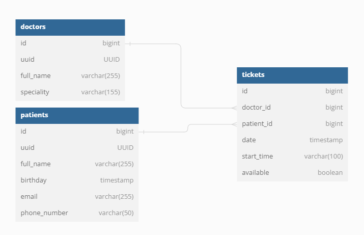

# Система записи пациентов на прием(тестовое задание)

## Стек используемых технологий:
* Java 17
* Spring Boot 3.2.2
* Spring Web Services
* PostgreSQL
* Liquibase
* Docker

## Описание приложения
Разработана система записи пациентов на прием. Система обеспечивает создание и просмотр врачей и пациентов, 
а также на основе передданых данных позволяет создать расписание для определенного врача.

## Модель базы данных представлена на ER-диаграмме:



## Руководство по локальному запуску и работе с приложением

1) Использовать ```git clone``` данного репозитория к себе на устройство
2) Запустить среду разработки ```Intellij Idea``` или другую аналогичную
3) Приложение также поддерживает запуск через Docker с помощью команды ```docker-compose up```, которую можно написать в
   терминале среды разработки
4) Приложение развернуто и готово принимать запросы по адресу: ```http://localhost:8080```
5) Также к приложению прилогается коллекция Postman-тестов для проверки основной функциональности в папке ```Postman```

## Список URL HTTP-методов

### ```POST /doctor/create```

Создает нового доктора

```json
{
    "fullName": "Иванов Иван Иванович",
    "speciality": "Терапевт"
}
```
### ```GET /doctor/{id}```

Получение доктора по его id

### ```POST /patient/create```

Создает нового пациента(в поле ```phoneNumber``` валидны только номера формата РФ)

```json
{
   "fullName": "Петров Петр Петрович",
   "birthday": "1990-01-01",
   "email": "ivanov@mail.ru",
   "phoneNumber": "+78805453535"
}
```

### ```GET /patient/{id}```

Получение пациента по его id

### ```GET /ws/tickets.wsdl```

Запрос просмотра передаваемых данных для SOAP-запроса создания расписания врача

### ```POST /ws```

SOAP-запрос для создания расписания

```xml
<soapenv:Envelope xmlns:soapenv="http://schemas.xmlsoap.org/soap/envelope/" xmlns:tic="http://ktelabs_test.ws/tickets">
   <soapenv:Header/>
   <soapenv:Body>
      <tic:ticketsRequest>
         <tic:doctorId>1</tic:doctorId>
         <tic:startTime>2024-02-01T10:00:00</tic:startTime>
         <tic:duration>30</tic:duration>
         <tic:count>8</tic:count>
      </tic:ticketsRequest>
   </soapenv:Body>
</soapenv:Envelope>
```

### ```GET tickets/doctor/{docId}```

Запрос на получение всех доступных полей у выбранного доктора за определенную дату. Пример строки:
```http://localhost:8080/tickets/doctor/:docId?date=2024-02-01```

### ```PATCH tickets/{ticketId}/patient/{patientId}```

Запрос на запись пациента в определенный слот записи

### ```GET tickets/patient/{patientId}```

Запрос на показ всех записей определенного пациента
